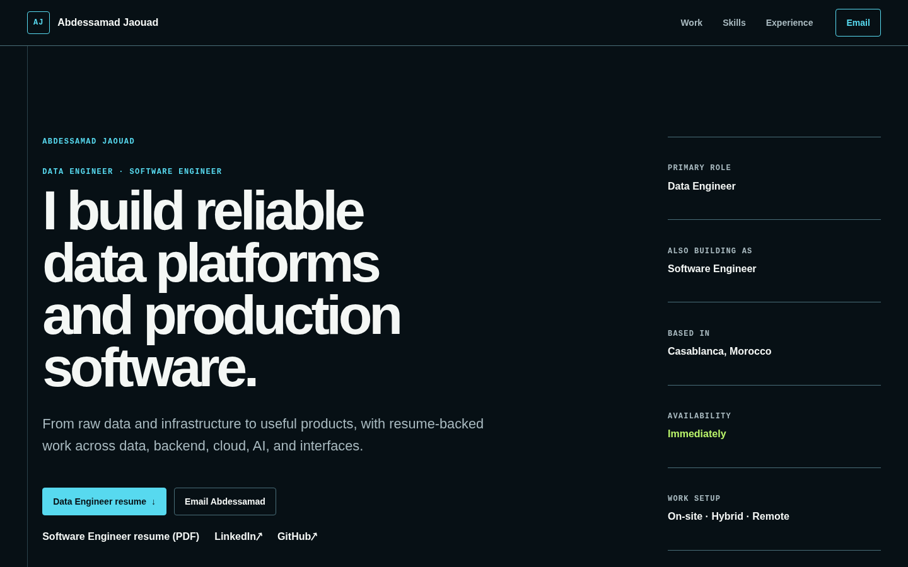

# Systems Atlas

Systems Atlas is the professional portfolio of [Abdessamad Jaouad](https://github.com/abdessamadjaouad), built to present Data Engineering work first and Software Engineering work second. It gives recruiters and engineering teams a fast, evidence-led view of experience, projects, technical skills, research, availability, resumes, and contact options.

The current implementation is a static, recruiter-first Next.js site backed by validated local content. It intentionally has no database, CMS, authentication, analytics, tracking, or contact-form backend.



_The current homepage at 1440 × 900. The portfolio also supports narrow mobile, tablet, wide desktop, reduced-motion, keyboard-only, and no-JavaScript use._

## What is included

- A complete recruiter-first homepage with role, location, immediate availability, work arrangements, and direct contact paths.
- Resume-backed employer highlights and personal-project summaries, with approved results presented in context.
- Skills connected to experience and project evidence instead of ratings or percentage bars.
- Education, certifications, languages, and the approved IEEE research title and link.
- Downloadable English resumes for both Data Engineering and Software Engineering.
- A typed content registry validated with Zod before content reaches presentation components.
- A reusable visual system and a `/design-lab` reference route.
- Unit, content-contract, responsive, interaction, download, and end-to-end browser tests.
- Static rendering and semantic HTML that keep the core experience useful without JavaScript.

Deep employer case studies, private employer artifacts, live GitHub fetching, a public French resume, and unverified project links or media are deliberately excluded. Missing evidence is omitted rather than replaced with invented content.

## Current status

The repository is implemented and approved through Phase 4 of the project plan:

| Area                                                    | Status          |
| ------------------------------------------------------- | --------------- |
| Product, content, architecture, and security planning   | Complete        |
| Next.js foundation and verification toolchain           | Complete        |
| Signal Ledger visual system and responsive design lab   | Complete        |
| Typed content registry and reviewed English resume PDFs | Complete        |
| Static recruiter homepage                               | Complete        |
| Deeper project experiences and later enhancements       | Not implemented |

See the [Phase 4 report](docs/phase-reports/phase-04.md) for the latest implementation evidence and known limitations.

## Technology stack

Versions are pinned in `package.json` and `package-lock.json`.

| Purpose                  | Technology                                                  |
| ------------------------ | ----------------------------------------------------------- |
| Application              | Next.js 16.3.1 App Router                                   |
| UI                       | React 19.2.8                                                |
| Language                 | TypeScript 5.9.3 in strict mode                             |
| Styling                  | Tailwind CSS 4.3.3, CSS Modules, and semantic design tokens |
| Content validation       | Zod 4.4.3                                                   |
| Unit and component tests | Vitest 4.1.11 and Testing Library                           |
| Browser tests            | Playwright 1.62.1 with Chromium                             |
| Code quality             | ESLint 9.39.5 and Prettier 3.9.6                            |
| Package manager          | npm 11.17.0                                                 |
| Runtime                  | Node.js 24.19.0                                             |

The homepage uses React Server Components throughout. It currently adds no client component, animation runtime, remote content request, or third-party script to the initial route.

## Architecture

Public output is separated from private source material by an explicit review and validation boundary:

```text
Private source material ── human review ──┐
                                         ├─> typed content records
Approved public facts ─── human review ──┘          │
                                                    ▼
                                             Zod validation
                                                    │
Reviewed public PDFs ── asset validation ───────────┤
                                                    ▼
                                           Server Components
                                                    │
                                                    ▼
                                       statically rendered portfolio
```

`src/content/registry.ts` is the application-facing content boundary. It assembles focused records from `src/content/records/`, validates them against the contracts in `src/content/schemas.ts`, and exposes parsed content to the presentation layer.

`next.config.ts` runs public-asset validation before compilation. Builds fail when a declared public asset is missing or invalid, when an undeclared file enters a governed public directory, or when a private source type crosses the publication boundary.

## Public routes and assets

| Path                                               | Purpose                                          |
| -------------------------------------------------- | ------------------------------------------------ |
| `/`                                                | Complete recruiter-first portfolio homepage      |
| `/design-lab`                                      | Responsive visual-system and component reference |
| `/resumes/abdessamad-jaouad-data-engineer.pdf`     | Reviewed English Data Engineer resume            |
| `/resumes/abdessamad-jaouad-software-engineer.pdf` | Reviewed English Software Engineer resume        |

The employer projects on the homepage are concise public experience highlights. They do not expose source code, repositories, internal screenshots, data, architecture, credentials, or private workflows.

## Getting started

### Prerequisites

- Git
- Node.js `>=24.19.0 <25`
- npm `>=11.17.0 <12`
- [mise](https://mise.jdx.dev/) is optional; `.mise.toml` pins Node.js 24.19.0.

### Install and run locally

```bash
git clone https://github.com/abdessamadjaouad/portfolio-website.git
cd portfolio-website

# Optional when mise is installed
mise install

npm ci
npm run dev
```

Open [http://localhost:3000](http://localhost:3000).

For a production-style local run:

```bash
npm run build
npm run start
```

## Available commands

| Command                | Purpose                                               |
| ---------------------- | ----------------------------------------------------- |
| `npm run dev`          | Start the Next.js development server                  |
| `npm run build`        | Create the production build with webpack              |
| `npm run start`        | Serve the production build                            |
| `npm run format`       | Format the repository with Prettier                   |
| `npm run format:check` | Check formatting without changing files               |
| `npm run lint`         | Run ESLint with zero warnings allowed                 |
| `npm run typecheck`    | Generate route types and run strict TypeScript checks |
| `npm run test`         | Run the Vitest suite once                             |
| `npm run test:watch`   | Run Vitest in watch mode                              |
| `npm run test:e2e`     | Run the Playwright browser suite                      |
| `npm run check:fast`   | Run formatting, lint, types, unit tests, and build    |
| `npm run check`        | Run the complete repository quality gate              |

The full quality gate is:

```bash
npm run format:check
npm run lint
npm run typecheck
npm run test
npm run test:e2e
npm run build
```

Or run the same sequence through `npm run check`.

## Project structure

```text
.
├── docs/
│   ├── phase-reports/       # Approval evidence for completed phases
│   ├── readme/              # README-specific public media
│   ├── architecture.md
│   ├── content-model.md
│   ├── design-system.md
│   └── product-brief.md
├── e2e/                     # Playwright browser and public-asset tests
├── public/
│   └── resumes/             # Reviewed English PDF derivatives only
├── src/
│   ├── app/                 # App Router pages, metadata, and global styles
│   ├── components/
│   │   ├── layout/          # Layout primitives
│   │   ├── portfolio/       # Homepage sections and composition
│   │   └── ui/              # Reusable UI primitives
│   └── content/
│       ├── records/         # Focused, typed content records
│       ├── registry.ts      # Canonical application-facing content registry
│       ├── schemas.ts       # Zod content contracts
│       └── validate-public-assets.ts
├── AGENTS.md                # Repository rules and publication boundaries
├── playwright.config.ts
├── portfolio-codex-implementation-plan.md
└── package.json
```

## Content workflow

Public facts should be changed in the appropriate file under `src/content/records/`, not duplicated inside JSX. Presentation components consume the validated registry so a name, title, date, metric, link, or publication decision has one canonical application source.

When changing content or public assets:

1. Verify the claim or asset against an approved source.
2. Update the focused content record and its evidence references.
3. Represent a genuinely unresolved, nonfeatured value with a structured `TODO_CONTENT_*` gap; never render polished placeholder copy.
4. Declare and review any new public asset before placing it under `public/`.
5. Keep employer material concise and sanitized.
6. Run the complete quality gate before requesting review.

The two public PDFs are reviewed derivatives. Resume source files and the French Data and AI resume are private and must never be copied, linked, indexed, or moved under `public/`.

## Testing and quality

The verification strategy covers several layers:

- **Content contracts:** schema rules, record relationships, identifiers, ordering, references, publication flags, and unresolved-content behavior.
- **Public assets:** file presence, containment, signatures, declarations, symlinks, and private-source exclusions.
- **Components and routes:** recruiter-visible facts, evidence ordering, metrics, contact order, and the absence of public placeholder text.
- **Browser behavior:** HTTP responses, metadata, headings, keyboard order, focus visibility, fragment links, outbound-link safety, and PDF downloads.
- **Responsive behavior:** 320px, 375px, the 320% zoom equivalent, 768px, 1440px, and 1920px layouts with horizontal-overflow checks.
- **Resilience:** reduced-motion and JavaScript-disabled experiences, plus browser console, page-error, and hydration monitoring.

At Phase 4 completion, the full gate passed 17 unit/component tests and 13 Chromium tests, followed by a successful production build. Exact command evidence is recorded in the [Phase 4 report](docs/phase-reports/phase-04.md).

## Accessibility and performance

- Semantic landmarks, ordered headings, native links, descriptive link text, and a visible skip link establish a clear document structure.
- Keyboard focus follows the visual order, uses a visible outline, and required actions meet the 44px touch-target minimum.
- Core content remains present without JavaScript and no information is hidden behind hover, animation, or WebGL.
- Reduced-motion preferences collapse feedback durations; the current homepage contains no advanced motion.
- The homepage is statically prerendered from local content and makes no runtime API, database, CMS, analytics, or GitHub request.
- Server Components keep homepage logic server-side and minimize client-side application JavaScript, while CSS Modules scope presentation styles.
- No image, video, custom font, animation package, or third-party script is part of the homepage's initial content load.

## Security and privacy

The current application has no user input, authentication, session, storage, server mutation, or data collection. Its relevant trust boundaries are validated local content, two reviewed public PDF derivatives, and approved outbound links.

- React's normal text rendering is used; raw HTML injection is absent.
- External HTTPS links opened in a new tab use `noopener noreferrer`.
- Public contact details are limited to explicitly approved destinations.
- Public-asset validation prevents private resume sources and undeclared files from entering governed asset directories.
- No employer repository, internal data, screenshot, report, schema, endpoint, hostname, credential, or workflow is published.
- No shared-drive content is fetched or linked.

## Documentation

- [Product brief](docs/product-brief.md) — audience, positioning, scope, and public boundaries
- [Architecture](docs/architecture.md) — runtime boundaries and system decisions
- [Content inventory](docs/content-inventory.md) — approved facts and evidence inventory
- [Content model](docs/content-model.md) — schemas, records, and validation lifecycle
- [Design directions](docs/design-directions.md) — explored visual directions and selection rationale
- [Design system](docs/design-system.md) — Signal Ledger tokens, layout, components, and responsive behavior
- [Decision log](docs/decision-log.md) — material product and engineering decisions
- [Implementation plan](portfolio-codex-implementation-plan.md) — phased delivery and approval gates
- [Phase reports](docs/phase-reports/) — delivered scope, commands, checks, and limitations

## Development protocol

Before making repository changes, read [AGENTS.md](AGENTS.md) and the [implementation plan](portfolio-codex-implementation-plan.md). Work is intentionally phase-gated: keep changes focused, preserve unrelated work, use only approved facts and dependencies, run the required checks, and stop for human approval before later-phase implementation.

## Contact

- Email: [abdessamadjaouad0@gmail.com](mailto:abdessamadjaouad0@gmail.com)
- LinkedIn: [linkedin.com/in/abdessamadjaouad](https://linkedin.com/in/abdessamadjaouad)
- GitHub: [github.com/abdessamadjaouad](https://github.com/abdessamadjaouad)

## License

No open-source license has been added to this repository. Do not assume permission to reuse its code, written content, resume documents, or visual assets.
